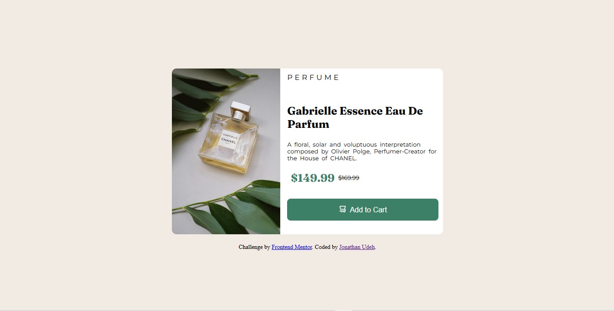

# Frontend Mentor - Product preview card

## Table of contents

- [Overview](#Overview)
  - [Screenshot](#Screenshot)
  - [Links](#Links)
- [My process](#My-process)
  - [Built with](#Built-with)
  - [What I learned](#What-i-learned)
  - [Continued development](#Continued-development)
- [Author](#Author)
- [Acknowledgments](#Acknowledgments)

## Overview
This project is all about building a preview card for a product on sales. It contains details about the product like product image, category, name, and prices and then abutton to add to cart.

## Screenshot

###  Links
- Live Site URL: [Live site]()

## My-process

### Built-with

- Semantic HTML5 markup
- CSS custom properties
- CSS Grid and flexbox
- Mobile-first workflow

### What-I-learned
Nothing new, Though I just practiced more with css grid.

### Continued-development
I will be using more of css grid layout as well as flexbox so as to get really familiarized with them both even though my flexbox skills are a lot smoother than that of my grid.

## Author
- Twitter - [jaywritescodes](https://x.com/jaywritescodes)
- LinkedIn - [jonathanudeh](https://www.frontendmentor.io/profile/jonathanudeh)
- Frontend Mentor - [jonathanudeh](https://www.frontendmentor.io/profile/jonathanudeh)

## Acknoledgement
Frontend Mentor: Thanks for providing the design and requirements for this project.